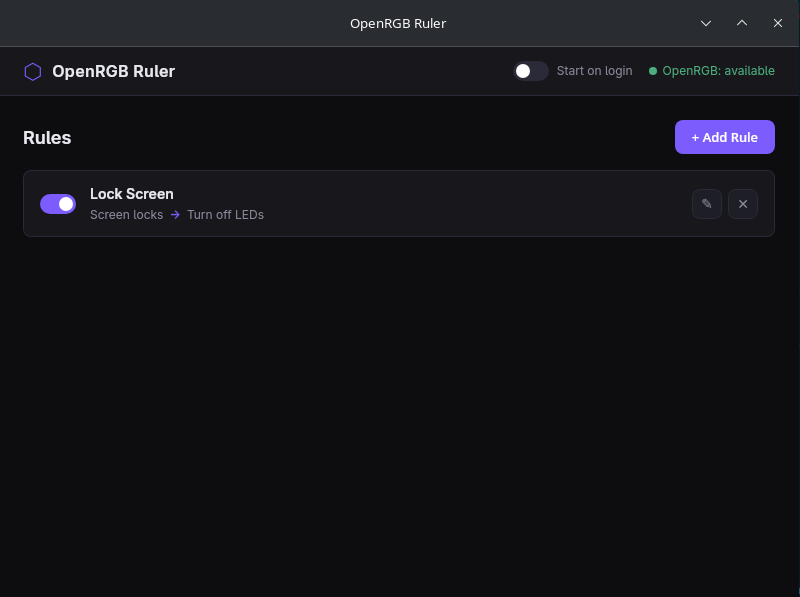

# OpenRGB Ruler

A **Tauri** (Rust + React/TypeScript) desktop application that lets you define **trigger → RGB action** rules for automated RGB lighting control via [OpenRGB](https://openrgb.org/).

Replace manual shell scripts with a GUI-configurable rules engine — lock your screen, launch a game, or go idle, and your RGB lighting responds automatically.

## Screenshots




## Features

- **Visual rules editor** — create, edit, reorder, and delete trigger→action rules without touching the terminal
- **Multiple trigger types**:
  - Screen lock / unlock (via DBus)
  - Process start / stop (polls `/proc`)
  - Session idle timeout
  - Time of day (cron-style)
- **Multiple RGB actions**:
  - Turn off all LEDs
  - Set a solid color (hex picker)
  - Load an OpenRGB profile
  - Set brightness (via OpenRGB SDK)
- **System tray** — the rules engine keeps running in the background even when the window is closed
- **Auto-start** — optionally launch on login
- **Live status bar** — shows OpenRGB connection state and last-fired rule

## Requirements

- Linux (KDE or GNOME recommended for DBus events)
- [`openrgb`](https://openrgb.org/) binary in `PATH`
- OpenRGB server running (for profile/SDK actions)

## Installation

Download the latest release for your distro from the [Releases](../../releases) page (`.deb`, `.rpm`, or `.AppImage`).

Or build from source — see [Contributing](CONTRIBUTING.md).

## Quick Start

1. Start **OpenRGB** and make sure it's running in server mode (`openrgb --server`).
2. Launch **OpenRGB Ruler**.
3. Click **Add Rule**, choose a trigger (e.g. *Screen Lock*) and an action (e.g. *Turn Off*).
4. Enable the rule and close the window — the engine keeps running in the tray.

## Rules Config

Rules are stored at `~/.config/openrgb-ruler/rules.json`. You can back them up or sync them across machines manually.

## Stack

| Layer | Technology |
|-------|-----------|
| Frontend | React 18 + TypeScript + Vite |
| Backend | Rust + Tauri v2 |
| RGB control | OpenRGB CLI / SDK (port 6742) |
| System events | zbus (DBus), `/proc` polling |
| Async runtime | Tokio |

## Dev Setup

```bash
# Install dependencies
yarn install

# Run in dev mode (hot-reload frontend + Rust)
yarn tauri dev

# Build release binary
yarn tauri build
```

Requires: Rust toolchain, Node.js ≥ 18, `yarn`, Tauri CLI v2 dependencies ([guide](https://tauri.app/start/prerequisites/)).

## Contributing

See [CONTRIBUTING.md](CONTRIBUTING.md).

## License

GNU General Public License v3.0 — see [LICENSE.md](LICENSE.md).
